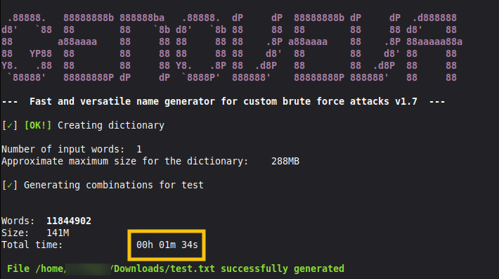
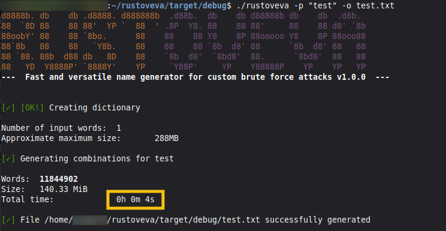

# RUSTOVEVA

 ## Original project: [Genoveva](https://github.com/joseaguardia/GENOVEVA)
 Completely rewritten to Rust for better performance.\
 Comparison between Genoveva and Rustoveva:\
 

 ### Fast and versatile name generator for custom brute force attacks

From a word list, it generates up to **17,335,754 combinations per word**, mixing lowercase, capitalized, uppercase, full and partial L33T (for each vowel and the letter "s"), reverse forms, numbers from 1 to 4 digits, dates in mmddyyyy format from 1950 to 2030, date format mmddyy, symbols at the end, symbols between name and date...

## Usage
`./rustoveva -p "word1 word2" -o outputFile [-vsm] [-r 8-12]`

Options

| Param. | Description |
| --- | --- |
| `-i` | **input file** containing the base words |
| `-p` | **list of words** to generate dictionary (quoted and space-separated) |
| `-o` | **output file** for the dictionary |
| `-r` | character **length range** to use. (format: 8-12 or 10-10) |
| `-m` | **generates fewer combinations** per word (minimal mode) |
| `-s` | splits output into **separate files for each word** |
| `-v` | **verbose mode** (displays generated combinations) |